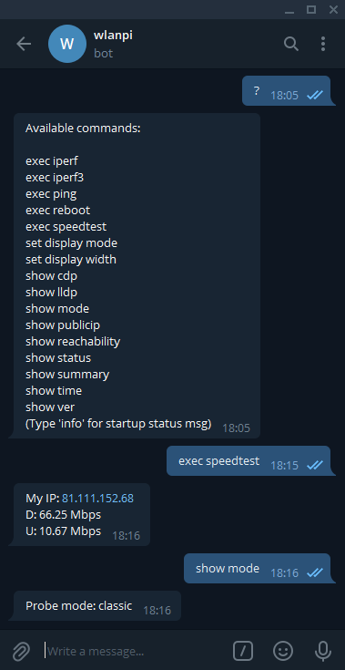

# wlanpi-chat-bot

Chat bot for the WLAN Pi project

*** Note that this code is still under development ***

# Debian Package Build/Install

```
# Build the deb package
git clone https://github.com/WLAN-Pi/wlanpi-telegram-bot.git
cd wlanpi-telegram-bot
sudo dpkg-buildpackage -us -uc

# The deb package is here
cd ..

# Install the package
sudo dpkg -i wlanpi-chat-bot_1.0.0_armhf.deb 

# Configure your Telegram API key and restart twice (so that Chat ID is obtained and you receive a new status message from the bot)
sudo nano /opt/wlanpi-chat-bot/etc/config.json
sudo systemctl restart wlanpi-chat-bot; sleep 5; sudo systemctl restart wlanpi-chat-bot 

# Uninstall the package while keeping the Chat Bot config file with your API key
sudo dpkg -r wlanpi-chat-bot

# Remove the package completely including Chat Bot config file with your API key
sudo dpkg -P wlanpi-chat-bot
```

# Commands

The following commands are available from the chat bot to gather info from the WLAN Pi or initiate actions:

```
Available commands:

iperf
iperf3
ping
reboot
set display mode
set display width
show cdp
show lldp
show mode
show publicip
show reachability
show status
show summary
show time
show uptime
show ver
speedtest

(Type 'info' for startup status msg)
```

To see the list of commands available, type `help` or `?` when sending messages to the WLANP Pi.

