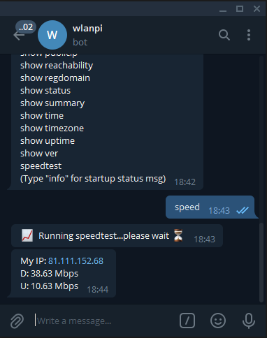

# User Guide for WLAN Pi Chat-Bot

## Overview
The WLAN Pi chat-bot is a Telegram bot that allows a number of remote operations to be performed on a WLAN Pi that has Internet connectivity. These include operations such as checking the status of the WLAN Pi and running tests such as speedtest and ping.

There are three steps to configure the chat-bot:

 - Install the Telegram application on a mobile device and create a Telegram account 
 - Configure yourself a bot on Telegram (this will be your WLAN Pi bot)
 - Configure an API key on the WLAN Pi to allow it to talk to your Telegram bot

These steps are detailed in the [Set-up section](#set-up) below.

Once the bot is operational, there are a number of commands that can be executed to obtain information and execute various tests and operations directly on the WLAN Pi. This provides a useful remote interface to the WLAN Pi. Operating the bot command interface covered in the [Using Chat-bot section](#using-chat-bot) below. 

## Set-up
The 3 steps required to set-up chat-bot are detailed below:

### Create a Telegram Account

Creating a Telegram account is an easy process. You need to download the Telegram app to your Apple or Android phone and then use the account creation options within the app. Here is an article about the process, but it should be pretty easy to follow the steps provided in the app:

 - [How to make a Telegram account ](https://www.businessinsider.com/how-to-make-a-telegram-account)

 (Note: you will need a phone number to complete the free sign-up for Telegram)

### Telegram

Once you have your Telegram account, you'll need to create a Telegram bot to talk with the WLAN Pi. This is a one-time operation. Once completed, you will be able to access the WAN Pi via this bot each time your WLAN Pi connects to the Interet.

Here are the basic instructions of how to configure the bot:

1. Start the Telegram app
2. Create a new Telegram bot: find a person called Botfather and send them a message saying `/newbot`
3. Follow the on-screen instructions to create a new bot and make a note of the API key that is provided
4. After the new bot is created, copy the API key to a text editor for later use

### Chat-bot

To configure the WLAN Pi to talk with the Telegram chat-bot, we need to configure the WLAN Pi with the API key provided when the bot was set up. There are two methods available:

1. SSH to the WLAN pi and edit the file `/etc/wlanpi-chat-bot/config.json`. Enter your API key in to the the `"bot_token"` field:

```
wlanpi@wlanpi:~$ sudo nano /etc/wlanpi-chat-bot/config.json`
```

```
{
    "telegram": {
        "bot_token": "1233735614:AAHe9eHOP_uCe6773bWjQTNvHT_llYHmFSw",
        "chat_id": "",
        "display_mode": "full",
        "display_width": "30",
    }
}
```
To ensure the API key is read correctly, restart the chat-bot process on the WLAN Pi:

```
wlanpi@wlanpi:~$ sudo systemctl restart wlanpi-chat-bot
```

2. For a completely headless configuration, it's possible to add a file to the micro-SD card that runs the WLAN Pi image. Pop the SD card out of the WLAN Pi and using a SD card-to-USB adapter, access the SD card via a USB port on your laptop or MAC. There is a readble partition called "boot" on the SD card where the chat-bot API key may be placed. 

Create a file called `wlanpi_bot.key` in the `boot` partition. Create the file with a plain text editor and add a single line that contains just the API key that was provided during bot creation. Here are a couple of screen-shots that show the file created on a Windows machine and a Mac:


Once the WLAN Pi boots up and reads the file from the boot partition, the API key is added to the WLAN Pi bot config file and removed from the boot partition for security purposes.

## Using Chat-Bot

To interact with the WLAN Pi chat-bot, commands are entered in to the Telegram app command UI. To see which commands are available, simply enter a "?" and hit enter. This will show all commands avaiable from the WLAN Pi:


### Entering Commands

Most commands are made up of a two parts:

    <verb> <noun>

For instance, to see CDP neighbours of a WLAN Pi, the command `show cdp` is used. In this instance, `show` is the verb and it is follwed by the noun `cdp`. Optionally, a command may also be followed by one or more arguments if they are appropriate to the command. For instance, to set the WLAN Pi hostname to `Keith`, the following command would be used:

```
set hostname Keith
```
`Keith` is an argument to the command `set hostname`.

Note that a small number of commands are single-word (verb-only) commands. For instance, `speedtest` and `ping` are verb-only. Here is screen-shot showing the ping command:


### Command Abbreviations

Typing the full command each time to perform an operation can be laborious. Therefore, it is possible to enter the minimum unique representation of each command. For instance, instead of entering the full command `speedtest`, this could be abbreviated to "speed", "spee", "spe" or "sp". "A single `s` would not be valid as this would clash with the `show` commands:



Note that both the verb and noun can be abbreviated, so that `show summary` command can be entered as `sh sum`:


### On-screen Help 

To gain additional help while using the chat bot, there are a couple of additional methods of finding useful information.

To get an extended description of how to use chat-bot the command `help` may be used:


If help is required for a particular command, it may be prefixed with the word `help` to gain addition insights such as command syntax. For example, to get help about the `show publicip` command, `help sh pub` may be used:


